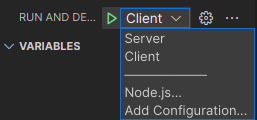

## Installation

### Dependences (optional)

```
sudo apt install clang-format
```

## Build

```
make
```

## Run

- Server:

```
  ./build/server
```

- Client:

```
 ./build/client

```

- Test :

```
./build/test
```

## Debug

> Choose Client or Server as below(`Ctrl+Shift+D` to open this panel)



## Project structure

```c
-.vscode        // Visual Code settings, config for debug, .v.v
-assets         // Images, .v.v for this README.md file
-build          // Built executable file will be created here
-include        // .h header files
-lib            // external library
-src            // .c source files
-.clang-format  // config file, for coding convention
-.gitignore     // ignore file when push code to git
-makefile       // don't edit this file
-README.md      // Document
```

## Description

## How to contribute

1. Clone this repository
2. Create new branch namely `development/feature-xxx`
3. Create pull request (details later)
